# Nova Foundation: The Irreducible 5

This document validates WHY the foundation has exactly 5 components, breaks each into atomic pieces, and provides step-by-step implementation instructions.

```mermaid
flowchart TB
    subgraph Foundation["The Irreducible 5"]
        direction TB
        S["Span<br/>📍 Where"]
        T["Token<br/>🔤 What"]
        SR["Source<br/>📄 Content"]
        E["Error<br/>⚠️ Report"]
        L["Lexer<br/>⚙️ How"]
    end

    SR --> L
    L --> T
    T --> S
    S --> E
    SR --> E

    style S fill:#06b6d4,stroke:#0891b2,color:#fff
    style T fill:#8b5cf6,stroke:#7c3aed,color:#fff
    style SR fill:#3b82f6,stroke:#2563eb,color:#fff
    style E fill:#f59e0b,stroke:#d97706,color:#fff
    style L fill:#14b8a6,stroke:#0d9488,color:#fff
```



> **Related Documents:**
> - [DECISIONS.md](DECISIONS.md) - Full architectural decision records with alternatives considered
> - [COMPONENTS.md](COMPONENTS.md) - Complete component breakdown (43 components)
> - [ROADMAP.md](ROADMAP.md) - Development timeline and milestones

> **Key Decisions Referenced:**
> - [ADR-001: Five Foundation Components](DECISIONS.md#adr-001-five-foundation-components)
> - [ADR-002: Span Size (8 bytes)](DECISIONS.md#adr-002-span-size-8-bytes)
> - [ADR-003: FileId Outside Span](DECISIONS.md#adr-003-fileid-outside-span)
> - [ADR-004: Token Size Optimization](DECISIONS.md#adr-004-token-size-optimization)
> - [ADR-005: Literal Values External to Tokens](DECISIONS.md#adr-005-literal-values-external-to-tokens)

## Why Exactly 5? (Research-Backed Validation)

```mermaid
flowchart LR
    subgraph merge["Why Not 4? (No Valid Merges)"]
        M1["Span + Source<br/>❌ Different lifetimes"]
        M2["Token + Span<br/>❌ Span used everywhere"]
        M3["Error + Span<br/>❌ Producer/Consumer"]
        M4["Lexer + Token<br/>❌ Data vs Process"]
    end

    subgraph add["Why Not 6? (All Belong Inside 5)"]
        A1["Symbol Interning<br/>→ Token"]
        A2["Keyword Table<br/>→ Lexer"]
        A3["Line Map<br/>→ Source"]
        A4["File ID<br/>→ Span"]
    end

    style M1 fill:#ef4444,stroke:#dc2626,color:#fff
    style M2 fill:#ef4444,stroke:#dc2626,color:#fff
    style M3 fill:#ef4444,stroke:#dc2626,color:#fff
    style M4 fill:#ef4444,stroke:#dc2626,color:#fff
    style A1 fill:#22c55e,stroke:#16a34a,color:#fff
    style A2 fill:#22c55e,stroke:#16a34a,color:#fff
    style A3 fill:#22c55e,stroke:#16a34a,color:#fff
    style A4 fill:#22c55e,stroke:#16a34a,color:#fff
```



### The Question
Could we have 4? Could we need 6? What is the **minimal complete** foundation?

### Cross-Compiler Evidence

| Compiler | Foundation Components | Count |
|----------|----------------------|-------|
| **Rust** | `rustc_span`, `token`, `rustc_errors`, `source_map`, `rustc_lexer` | 5 |
| **Go** | `token`, `scanner`, `position`, `errors`, `source` | 5 |
| **Swift** | `Token`, `Lexer`, `SourceLoc`, `Diagnostics`, `SourceManager` | 5 |
| **TypeScript** | `SyntaxKind`, `Scanner`, `TextRange`, `Diagnostic`, `SourceFile` | 5 |
| **Zig** | `Token`, `Tokenizer`, `Location`, `Error`, `Source` | 5 |

**Every production compiler converges on 5 foundation components.**

### Why Not 4? (What Would We Merge?)

| Merge Option | Why It Fails |
|--------------|--------------|
| Span + Source | Span is a value type (16 bytes, copied everywhere). Source is a reference type (holds file contents). Different lifetimes, different concerns. |
| Token + Span | Token needs Span, but Span is also used by AST nodes, errors, IR nodes. Span must be independent. |
| Error + Span | Error formats Span into human-readable output. They're producer/consumer, not peers. |
| Lexer + Token | Token is a data type. Lexer is a process. Mixing data and process violates separation of concerns. |

**Conclusion: No valid merges exist.**

### Why Not 6? (What Would We Add?)

| Addition | Why It's Wrong |
|----------|----------------|
| Symbol Interning | Optimization, not foundation. Can be added to Token later. |
| Keyword Table | Part of Lexer, not separate. |
| Operator Precedence | Part of Token, not separate. |
| Line Map | Part of Source, not separate. |
| File ID | Part of Span, not separate. |

**Conclusion: Anything we add belongs inside one of the 5.**

### The Irreducible 5

```
┌─────────────────────────────────────────────────────────────────────┐
│                     THE IRREDUCIBLE 5                               │
│                                                                     │
│  ┌─────────┐    ┌─────────┐    ┌─────────┐                        │
│  │  SPAN   │───▶│  TOKEN  │───▶│  LEXER  │                        │
│  │ (where) │    │ (what)  │    │ (how)   │                        │
│  └────┬────┘    └─────────┘    └────┬────┘                        │
│       │                             │                              │
│       ▼                             ▼                              │
│  ┌─────────┐                   ┌─────────┐                        │
│  │ SOURCE  │──────────────────▶│  ERROR  │                        │
│  │(content)│                   │(report) │                        │
│  └─────────┘                   └─────────┘                        │
│                                                                     │
│  Dependency flow: Span → Token → Lexer                             │
│                   Span → Source → Error                            │
│                   Token + Error = complete foundation              │
└─────────────────────────────────────────────────────────────────────┘
```

### Why These 5 Are Necessary

| Component | Question It Answers | Without It |
|-----------|--------------------| -----------|
| **Span** | "Where in the source?" | Can't report error locations |
| **Token** | "What did we see?" | Can't represent lexer output |
| **Source** | "What is the source?" | Can't show source context in errors |
| **Error** | "What went wrong?" | Can't communicate with users |
| **Lexer** | "How do we tokenize?" | Can't convert source to tokens |

**Each answers exactly ONE fundamental question. None are redundant.**

---

## Component 1: SPAN (The Location Primitive)

> **Design Decisions:**
> - [ADR-002: Span Size (8 bytes)](DECISIONS.md#adr-002-span-size-8-bytes) - Why exactly 8 bytes, not 16 or 12
> - [ADR-003: FileId Outside Span](DECISIONS.md#adr-003-fileid-outside-span) - Why FileId is not embedded in Span


**Nova: 8 bytes** | Rust: 12 bytes | Naive: 40+ bytes

### What Is It?
A span is a range of byte offsets in source code. It's the **atomic unit of location**.

### Why First?
Everything references Span:
- Tokens have spans
- AST nodes have spans
- Errors have spans
- IR nodes can have spans

Span must exist before anything else.

### Atomic Breakdown

```
SPAN COMPONENT (7 atoms)
═══════════════════════

Atom 1.1: ByteOffset
├── Type: u32 (4 bytes, supports files up to 4GB)
├── Purpose: Single position in source
├── Test: ByteOffset(0), ByteOffset(MAX)
└── Time: 15 min

Atom 1.2: Span struct
├── Fields: start: ByteOffset, end: ByteOffset
├── Size: Exactly 8 bytes (must fit in register pair)
├── Invariant: start <= end (enforced at construction)
├── Test: Span::new(0, 10), Span::new(5, 5) [empty span]
└── Time: 20 min

Atom 1.3: Span constructors
├── Span::new(start, end) - validated
├── Span::empty(offset) - zero-width span for EOF, insertions
├── Span::from_len(start, len) - when you know length
├── Test: Each constructor with valid/invalid inputs
└── Time: 25 min

Atom 1.4: Span operations
├── merge(self, other) → Span covering both
├── contains(self, offset) → bool
├── overlaps(self, other) → bool
├── intersect(self, other) → Option<Span>
├── Test: Edge cases (adjacent, disjoint, nested)
└── Time: 30 min

Atom 1.5: Span traits
├── Copy, Clone (zero-cost)
├── Debug, Display
├── PartialEq, Eq, Hash (for use in HashMaps)
├── PartialOrd, Ord (for sorting)
├── Test: HashMap<Span, _>, BTreeSet<Span>
└── Time: 20 min

Atom 1.6: FileId
├── Type: u32 (supports 4 billion files per compilation)
├── Purpose: Distinguish spans from different files
├── Location: Can be in Span or external
├── Decision: Keep external (Span stays 8 bytes)
├── Test: FileId(0), FileId(MAX)
└── Time: 15 min

Atom 1.7: Spanned<T> wrapper
├── Generic wrapper: struct Spanned<T> { node: T, span: Span }
├── Implements Deref to T
├── Used for: AST nodes, tokens, anything with location
├── Test: Spanned<i32>, Spanned<String>
└── Time: 25 min

TOTAL: ~2.5 hours for complete Span implementation
```

### Implementation Order

```rust
// Step 1: ByteOffset (15 min)
#[derive(Clone, Copy, Debug, PartialEq, Eq, PartialOrd, Ord, Hash)]
pub struct ByteOffset(pub u32);

impl ByteOffset {
    pub const ZERO: ByteOffset = ByteOffset(0);
    pub const MAX: ByteOffset = ByteOffset(u32::MAX);

    #[inline]
    pub fn offset(self, delta: u32) -> ByteOffset {
        ByteOffset(self.0.saturating_add(delta))
    }
}

// Step 2: Span struct (20 min)
#[derive(Clone, Copy, Debug, PartialEq, Eq, Hash)]
pub struct Span {
    start: ByteOffset,
    end: ByteOffset,
}

impl Span {
    /// Create a new span. Panics if start > end.
    #[inline]
    pub fn new(start: u32, end: u32) -> Span {
        debug_assert!(start <= end, "Span start must be <= end");
        Span {
            start: ByteOffset(start),
            end: ByteOffset(end),
        }
    }

    /// Create an empty span at a position (for EOF, insertions)
    #[inline]
    pub fn empty(offset: u32) -> Span {
        Span::new(offset, offset)
    }
}

// Step 3: Constructors (25 min)
impl Span {
    /// Create span from start position and length
    #[inline]
    pub fn from_len(start: u32, len: u32) -> Span {
        Span::new(start, start.saturating_add(len))
    }

    /// The "dummy" span for generated code
    pub const DUMMY: Span = Span {
        start: ByteOffset(0),
        end: ByteOffset(0),
    };
}

// Step 4: Operations (30 min)
impl Span {
    #[inline]
    pub fn start(&self) -> u32 { self.start.0 }

    #[inline]
    pub fn end(&self) -> u32 { self.end.0 }

    #[inline]
    pub fn len(&self) -> u32 { self.end.0 - self.start.0 }

    #[inline]
    pub fn is_empty(&self) -> bool { self.start == self.end }

    /// Merge two spans into one covering both
    #[inline]
    pub fn merge(self, other: Span) -> Span {
        Span {
            start: ByteOffset(self.start.0.min(other.start.0)),
            end: ByteOffset(self.end.0.max(other.end.0)),
        }
    }

    /// Check if offset is within this span
    #[inline]
    pub fn contains(&self, offset: u32) -> bool {
        offset >= self.start.0 && offset < self.end.0
    }

    /// Check if two spans overlap
    #[inline]
    pub fn overlaps(&self, other: &Span) -> bool {
        self.start.0 < other.end.0 && other.start.0 < self.end.0
    }

    /// Get intersection of two spans
    pub fn intersect(&self, other: &Span) -> Option<Span> {
        if self.overlaps(other) {
            Some(Span {
                start: ByteOffset(self.start.0.max(other.start.0)),
                end: ByteOffset(self.end.0.min(other.end.0)),
            })
        } else {
            None
        }
    }
}

// Step 5: Additional traits (20 min)
impl std::fmt::Display for Span {
    fn fmt(&self, f: &mut std::fmt::Formatter<'_>) -> std::fmt::Result {
        write!(f, "{}..{}", self.start.0, self.end.0)
    }
}

impl PartialOrd for Span {
    fn partial_cmp(&self, other: &Self) -> Option<std::cmp::Ordering> {
        Some(self.cmp(other))
    }
}

impl Ord for Span {
    fn cmp(&self, other: &Self) -> std::cmp::Ordering {
        self.start.cmp(&other.start)
            .then_with(|| self.end.cmp(&other.end))
    }
}

// Step 6: FileId (15 min)
#[derive(Clone, Copy, Debug, PartialEq, Eq, Hash)]
pub struct FileId(pub u32);

impl FileId {
    pub const DUMMY: FileId = FileId(0);
}

// Step 7: Spanned<T> (25 min)
#[derive(Clone, Copy, Debug, PartialEq, Eq, Hash)]
pub struct Spanned<T> {
    pub node: T,
    pub span: Span,
}

impl<T> Spanned<T> {
    pub fn new(node: T, span: Span) -> Self {
        Spanned { node, span }
    }

    pub fn map<U>(self, f: impl FnOnce(T) -> U) -> Spanned<U> {
        Spanned {
            node: f(self.node),
            span: self.span,
        }
    }
}

impl<T> std::ops::Deref for Spanned<T> {
    type Target = T;
    fn deref(&self) -> &T { &self.node }
}
```

### Tests for Span (Minimum 15)

```rust
#[cfg(test)]
mod tests {
    use super::*;

    // Atom 1.1: ByteOffset
    #[test]
    fn byte_offset_zero() {
        assert_eq!(ByteOffset::ZERO.0, 0);
    }

    #[test]
    fn byte_offset_max() {
        assert_eq!(ByteOffset::MAX.0, u32::MAX);
    }

    #[test]
    fn byte_offset_saturating() {
        assert_eq!(ByteOffset::MAX.offset(1), ByteOffset::MAX);
    }

    // Atom 1.2: Span struct
    #[test]
    fn span_size() {
        assert_eq!(std::mem::size_of::<Span>(), 8);
    }

    #[test]
    fn span_new() {
        let s = Span::new(5, 10);
        assert_eq!(s.start(), 5);
        assert_eq!(s.end(), 10);
    }

    // Atom 1.3: Constructors
    #[test]
    fn span_empty() {
        let s = Span::empty(5);
        assert!(s.is_empty());
        assert_eq!(s.len(), 0);
    }

    #[test]
    fn span_from_len() {
        let s = Span::from_len(10, 5);
        assert_eq!(s.start(), 10);
        assert_eq!(s.end(), 15);
    }

    // Atom 1.4: Operations
    #[test]
    fn span_merge_overlapping() {
        let a = Span::new(0, 5);
        let b = Span::new(3, 10);
        assert_eq!(a.merge(b), Span::new(0, 10));
    }

    #[test]
    fn span_merge_disjoint() {
        let a = Span::new(0, 5);
        let b = Span::new(10, 15);
        assert_eq!(a.merge(b), Span::new(0, 15));
    }

    #[test]
    fn span_contains() {
        let s = Span::new(5, 10);
        assert!(s.contains(5));
        assert!(s.contains(9));
        assert!(!s.contains(10)); // end-exclusive
        assert!(!s.contains(4));
    }

    #[test]
    fn span_overlaps() {
        let a = Span::new(0, 5);
        let b = Span::new(3, 10);
        let c = Span::new(5, 10);
        assert!(a.overlaps(&b));
        assert!(!a.overlaps(&c)); // adjacent = not overlapping
    }

    #[test]
    fn span_intersect() {
        let a = Span::new(0, 10);
        let b = Span::new(5, 15);
        assert_eq!(a.intersect(&b), Some(Span::new(5, 10)));
    }

    #[test]
    fn span_intersect_disjoint() {
        let a = Span::new(0, 5);
        let b = Span::new(10, 15);
        assert_eq!(a.intersect(&b), None);
    }

    // Atom 1.5: Traits
    #[test]
    fn span_hashable() {
        use std::collections::HashSet;
        let mut set = HashSet::new();
        set.insert(Span::new(0, 5));
        set.insert(Span::new(0, 5)); // duplicate
        assert_eq!(set.len(), 1);
    }

    #[test]
    fn span_orderable() {
        use std::collections::BTreeSet;
        let mut set = BTreeSet::new();
        set.insert(Span::new(5, 10));
        set.insert(Span::new(0, 5));
        let v: Vec<_> = set.into_iter().collect();
        assert_eq!(v[0], Span::new(0, 5));
    }
}
```

### QA Checklist for Span

- [ ] Size is exactly 8 bytes (`size_of::<Span>() == 8`)
- [ ] All operations are `#[inline]`
- [ ] No heap allocations
- [ ] No panics in release (debug_assert only)
- [ ] 15+ unit tests passing
- [ ] 100% line coverage
- [ ] `cargo clippy` zero warnings
- [ ] All public items documented

---

## Component 2: TOKEN (The Lexical Unit)

> **Design Decisions:**
> - [ADR-004: Token Size Optimization](DECISIONS.md#adr-004-token-size-optimization) - Why Token is exactly 12 bytes
> - [ADR-005: Literal Values External to Tokens](DECISIONS.md#adr-005-literal-values-external-to-tokens) - Why values aren't stored in Token
> - [ADR-013: Keyword Selection](DECISIONS.md#adr-013-keyword-selection) - Why these 30 keywords
> - [ADR-014: Operator Precedence Table](DECISIONS.md#adr-014-operator-precedence-table) - Why this precedence order

```mermaid
flowchart LR
    subgraph Token["Token (12 bytes total)"]
        direction LR
        K["kind: TokenKind<br/>1 byte"]
        P["padding<br/>3 bytes"]
        S["span: Span<br/>8 bytes"]
    end

    subgraph Comparison["Size Comparison"]
        direction TB
        C1["Nova: 12 bytes ✓"]
        C2["Rust: 16 bytes"]
        C3["With String: 40+ bytes"]
    end

    style Token fill:#6366f1,stroke:#4f46e5,color:#fff
    style C1 fill:#22c55e,stroke:#16a34a,color:#fff
    style C2 fill:#f59e0b,stroke:#d97706,color:#fff
    style C3 fill:#ef4444,stroke:#dc2626,color:#fff
```



### What Is It?
A token is the atomic unit of syntax. It's what the lexer produces and the parser consumes.

### Why Second?
Token needs Span (to know where it is). Parser needs Token (to know what to parse).

### Atomic Breakdown

```
TOKEN COMPONENT (9 atoms)
═════════════════════════

Atom 2.1: TokenKind enum (core variants)
├── Variants: EOF, Error, Whitespace, Comment
├── These are "structural" - not language-specific
├── Test: Each variant exists, Display works
└── Time: 15 min

Atom 2.2: TokenKind literals
├── Variants: Int, Float, String, Char, Bool
├── Purpose: Represent literal values in source
├── No value stored - just the kind
├── Test: TokenKind::Int.is_literal() == true
└── Time: 20 min

Atom 2.3: TokenKind keywords
├── Variants: Fn, Let, Mut, If, Else, While, For, Return, ...
├── Count: 25-30 keywords (language-dependent)
├── Test: TokenKind::Fn.is_keyword() == true
└── Time: 30 min

Atom 2.4: TokenKind operators
├── Single-char: + - * / % & | ^ ! < > =
├── Multi-char: == != <= >= && || -> => :: += -= *= /=
├── Purpose: All operators the language supports
├── Test: TokenKind::Plus.is_operator() == true
└── Time: 30 min

Atom 2.5: TokenKind punctuation
├── Variants: LParen, RParen, LBrace, RBrace, LBracket, RBracket
├── Also: Comma, Semicolon, Colon, Dot, At, Hash
├── Test: All punctuation variants exist
└── Time: 15 min

Atom 2.6: TokenKind identifiers
├── Variant: Ident (for variable/function names)
├── Note: Actual string is NOT stored in TokenKind
├── Test: TokenKind::Ident.is_identifier() == true
└── Time: 10 min

Atom 2.7: Token struct
├── Fields: kind: TokenKind, span: Span
├── Size: 12 bytes (4 for kind + 8 for span)
├── Note: Literal values stored separately
├── Test: Token construction, field access
└── Time: 20 min

Atom 2.8: Operator precedence
├── Method: TokenKind::precedence() -> Option<u8>
├── Pratt parsing needs this
├── Higher number = higher precedence
├── Test: Plus.precedence() < Star.precedence()
└── Time: 25 min

Atom 2.9: Token classification methods
├── is_keyword() -> bool
├── is_operator() -> bool
├── is_literal() -> bool
├── is_punctuation() -> bool
├── can_start_expression() -> bool
├── can_start_statement() -> bool
├── Test: Each method for all relevant variants
└── Time: 30 min

TOTAL: ~3.5 hours for complete Token implementation
```

### Implementation Order

```rust
// Step 1: Core TokenKind variants (15 min)
#[derive(Clone, Copy, Debug, PartialEq, Eq, Hash)]
pub enum TokenKind {
    // Structural (always present)
    Eof,
    Error,
    Whitespace,
    Comment,
    Newline,

    // Step 2: Literals (20 min)
    IntLit,      // 42, 0xFF, 0b1010
    FloatLit,    // 3.14, 1e10
    StringLit,   // "hello"
    CharLit,     // 'a'
    BoolLit,     // true, false

    // Step 3: Keywords (30 min)
    // Declarations
    Fn,
    Let,
    Const,
    Mut,
    Struct,
    Enum,
    Trait,
    Impl,
    Type,
    Mod,
    Use,
    Pub,

    // Control flow
    If,
    Else,
    Match,
    While,
    For,
    Loop,
    Break,
    Continue,
    Return,

    // Other keywords
    As,
    In,
    Where,
    Self_,   // self
    SelfTy,  // Self
    Super,
    Crate,

    // Step 4: Operators (30 min)
    // Arithmetic
    Plus,        // +
    Minus,       // -
    Star,        // *
    Slash,       // /
    Percent,     // %

    // Bitwise
    Amp,         // &
    Pipe,        // |
    Caret,       // ^
    Tilde,       // ~
    Shl,         // <<
    Shr,         // >>

    // Comparison
    Eq,          // ==
    Ne,          // !=
    Lt,          // <
    Le,          // <=
    Gt,          // >
    Ge,          // >=

    // Logical
    And,         // &&
    Or,          // ||
    Not,         // !

    // Assignment
    Assign,      // =
    PlusEq,      // +=
    MinusEq,     // -=
    StarEq,      // *=
    SlashEq,     // /=
    PercentEq,   // %=
    AmpEq,       // &=
    PipeEq,      // |=
    CaretEq,     // ^=
    ShlEq,       // <<=
    ShrEq,       // >>=

    // Other operators
    Arrow,       // ->
    FatArrow,    // =>
    ColonColon,  // ::
    DotDot,      // ..
    DotDotEq,    // ..=
    Question,    // ?

    // Step 5: Punctuation (15 min)
    LParen,      // (
    RParen,      // )
    LBrace,      // {
    RBrace,      // }
    LBracket,    // [
    RBracket,    // ]
    Comma,       // ,
    Semicolon,   // ;
    Colon,       // :
    Dot,         // .
    At,          // @
    Hash,        // #
    Dollar,      // $
    Underscore,  // _

    // Step 6: Identifier (10 min)
    Ident,
}

// Step 7: Token struct (20 min)
#[derive(Clone, Copy, Debug, PartialEq, Eq)]
pub struct Token {
    pub kind: TokenKind,
    pub span: Span,
}

impl Token {
    #[inline]
    pub fn new(kind: TokenKind, span: Span) -> Token {
        Token { kind, span }
    }

    #[inline]
    pub fn eof(offset: u32) -> Token {
        Token::new(TokenKind::Eof, Span::empty(offset))
    }

    #[inline]
    pub fn is_eof(&self) -> bool {
        self.kind == TokenKind::Eof
    }
}

// Step 8: Operator precedence (25 min)
impl TokenKind {
    /// Returns the precedence for binary operators (for Pratt parsing)
    /// Higher number = binds tighter
    /// Returns None for non-operators
    pub fn precedence(&self) -> Option<u8> {
        use TokenKind::*;
        match self {
            // Assignment (lowest precedence, right-associative)
            Assign | PlusEq | MinusEq | StarEq | SlashEq |
            PercentEq | AmpEq | PipeEq | CaretEq | ShlEq | ShrEq => Some(1),

            // Range
            DotDot | DotDotEq => Some(2),

            // Logical OR
            Or => Some(3),

            // Logical AND
            And => Some(4),

            // Comparison
            Eq | Ne | Lt | Le | Gt | Ge => Some(5),

            // Bitwise OR
            Pipe => Some(6),

            // Bitwise XOR
            Caret => Some(7),

            // Bitwise AND
            Amp => Some(8),

            // Shift
            Shl | Shr => Some(9),

            // Additive
            Plus | Minus => Some(10),

            // Multiplicative
            Star | Slash | Percent => Some(11),

            // Type cast
            As => Some(12),

            // Unary (highest precedence for prefix ops)
            Not | Tilde => Some(13),

            // Not a binary operator
            _ => None,
        }
    }

    /// Is this a right-associative operator?
    pub fn is_right_associative(&self) -> bool {
        use TokenKind::*;
        matches!(self,
            Assign | PlusEq | MinusEq | StarEq | SlashEq |
            PercentEq | AmpEq | PipeEq | CaretEq | ShlEq | ShrEq
        )
    }
}

// Step 9: Classification methods (30 min)
impl TokenKind {
    pub fn is_keyword(&self) -> bool {
        use TokenKind::*;
        matches!(self,
            Fn | Let | Const | Mut | Struct | Enum | Trait | Impl |
            Type | Mod | Use | Pub | If | Else | Match | While | For |
            Loop | Break | Continue | Return | As | In | Where |
            Self_ | SelfTy | Super | Crate | BoolLit
        )
    }

    pub fn is_operator(&self) -> bool {
        self.precedence().is_some() || matches!(self,
            TokenKind::Arrow | TokenKind::FatArrow |
            TokenKind::ColonColon | TokenKind::Question
        )
    }

    pub fn is_literal(&self) -> bool {
        use TokenKind::*;
        matches!(self, IntLit | FloatLit | StringLit | CharLit | BoolLit)
    }

    pub fn is_punctuation(&self) -> bool {
        use TokenKind::*;
        matches!(self,
            LParen | RParen | LBrace | RBrace | LBracket | RBracket |
            Comma | Semicolon | Colon | Dot | At | Hash | Dollar | Underscore
        )
    }

    /// Can this token start an expression?
    pub fn can_start_expr(&self) -> bool {
        use TokenKind::*;
        matches!(self,
            // Literals
            IntLit | FloatLit | StringLit | CharLit | BoolLit |
            // Identifiers
            Ident | Self_ | SelfTy |
            // Grouping
            LParen | LBracket | LBrace |
            // Prefix operators
            Minus | Not | Tilde | Amp | Star |
            // Control flow expressions
            If | Match | Loop | While | For |
            // Closures
            Pipe | Or |
            // Keywords that start expressions
            Return | Break | Continue
        )
    }

    /// Can this token start a statement?
    pub fn can_start_stmt(&self) -> bool {
        use TokenKind::*;
        matches!(self,
            // Declarations
            Fn | Let | Const | Struct | Enum | Trait | Impl |
            Type | Mod | Use | Pub |
            // Control flow
            If | Match | While | For | Loop | Return | Break | Continue |
            // Expression statements
            _ if self.can_start_expr() => true,
            _ => false,
        )
    }
}

// Display implementation for error messages
impl std::fmt::Display for TokenKind {
    fn fmt(&self, f: &mut std::fmt::Formatter<'_>) -> std::fmt::Result {
        use TokenKind::*;
        let s = match self {
            Eof => "end of file",
            Error => "error",
            Whitespace => "whitespace",
            Comment => "comment",
            Newline => "newline",
            IntLit => "integer literal",
            FloatLit => "float literal",
            StringLit => "string literal",
            CharLit => "character literal",
            BoolLit => "boolean literal",
            Ident => "identifier",
            // Keywords
            Fn => "fn",
            Let => "let",
            Const => "const",
            Mut => "mut",
            Struct => "struct",
            Enum => "enum",
            Trait => "trait",
            Impl => "impl",
            Type => "type",
            Mod => "mod",
            Use => "use",
            Pub => "pub",
            If => "if",
            Else => "else",
            Match => "match",
            While => "while",
            For => "for",
            Loop => "loop",
            Break => "break",
            Continue => "continue",
            Return => "return",
            As => "as",
            In => "in",
            Where => "where",
            Self_ => "self",
            SelfTy => "Self",
            Super => "super",
            Crate => "crate",
            // Operators
            Plus => "+",
            Minus => "-",
            Star => "*",
            Slash => "/",
            Percent => "%",
            Amp => "&",
            Pipe => "|",
            Caret => "^",
            Tilde => "~",
            Shl => "<<",
            Shr => ">>",
            Eq => "==",
            Ne => "!=",
            Lt => "<",
            Le => "<=",
            Gt => ">",
            Ge => ">=",
            And => "&&",
            Or => "||",
            Not => "!",
            Assign => "=",
            PlusEq => "+=",
            MinusEq => "-=",
            StarEq => "*=",
            SlashEq => "/=",
            PercentEq => "%=",
            AmpEq => "&=",
            PipeEq => "|=",
            CaretEq => "^=",
            ShlEq => "<<=",
            ShrEq => ">>=",
            Arrow => "->",
            FatArrow => "=>",
            ColonColon => "::",
            DotDot => "..",
            DotDotEq => "..=",
            Question => "?",
            // Punctuation
            LParen => "(",
            RParen => ")",
            LBrace => "{",
            RBrace => "}",
            LBracket => "[",
            RBracket => "]",
            Comma => ",",
            Semicolon => ";",
            Colon => ":",
            Dot => ".",
            At => "@",
            Hash => "#",
            Dollar => "$",
            Underscore => "_",
        };
        write!(f, "{}", s)
    }
}
```

### Tests for Token (Minimum 30)

```rust
#[cfg(test)]
mod tests {
    use super::*;

    // Size checks
    #[test]
    fn token_kind_size() {
        assert!(std::mem::size_of::<TokenKind>() <= 1, "TokenKind should fit in 1 byte");
    }

    #[test]
    fn token_size() {
        assert!(std::mem::size_of::<Token>() <= 12, "Token should be ≤12 bytes");
    }

    // Keyword tests
    #[test]
    fn fn_is_keyword() { assert!(TokenKind::Fn.is_keyword()); }
    #[test]
    fn let_is_keyword() { assert!(TokenKind::Let.is_keyword()); }
    #[test]
    fn if_is_keyword() { assert!(TokenKind::If.is_keyword()); }

    // Operator tests
    #[test]
    fn plus_is_operator() { assert!(TokenKind::Plus.is_operator()); }
    #[test]
    fn star_is_operator() { assert!(TokenKind::Star.is_operator()); }

    // Literal tests
    #[test]
    fn int_is_literal() { assert!(TokenKind::IntLit.is_literal()); }
    #[test]
    fn string_is_literal() { assert!(TokenKind::StringLit.is_literal()); }

    // Precedence tests
    #[test]
    fn mul_binds_tighter_than_add() {
        let add = TokenKind::Plus.precedence().unwrap();
        let mul = TokenKind::Star.precedence().unwrap();
        assert!(mul > add);
    }

    #[test]
    fn and_binds_tighter_than_or() {
        let and = TokenKind::And.precedence().unwrap();
        let or = TokenKind::Or.precedence().unwrap();
        assert!(and > or);
    }

    #[test]
    fn comparison_binds_tighter_than_logical() {
        let cmp = TokenKind::Lt.precedence().unwrap();
        let log = TokenKind::And.precedence().unwrap();
        assert!(cmp > log);
    }

    // Expression start tests
    #[test]
    fn ident_starts_expr() { assert!(TokenKind::Ident.can_start_expr()); }
    #[test]
    fn int_starts_expr() { assert!(TokenKind::IntLit.can_start_expr()); }
    #[test]
    fn if_starts_expr() { assert!(TokenKind::If.can_start_expr()); }
    #[test]
    fn semicolon_does_not_start_expr() { assert!(!TokenKind::Semicolon.can_start_expr()); }

    // Statement start tests
    #[test]
    fn fn_starts_stmt() { assert!(TokenKind::Fn.can_start_stmt()); }
    #[test]
    fn let_starts_stmt() { assert!(TokenKind::Let.can_start_stmt()); }

    // Display tests
    #[test]
    fn display_keywords() {
        assert_eq!(format!("{}", TokenKind::Fn), "fn");
        assert_eq!(format!("{}", TokenKind::Let), "let");
    }

    #[test]
    fn display_operators() {
        assert_eq!(format!("{}", TokenKind::Plus), "+");
        assert_eq!(format!("{}", TokenKind::Arrow), "->");
    }

    // Token construction
    #[test]
    fn token_new() {
        let t = Token::new(TokenKind::Plus, Span::new(0, 1));
        assert_eq!(t.kind, TokenKind::Plus);
        assert_eq!(t.span, Span::new(0, 1));
    }

    #[test]
    fn token_eof() {
        let t = Token::eof(100);
        assert!(t.is_eof());
        assert!(t.span.is_empty());
    }
}
```

### QA Checklist for Token

- [ ] `TokenKind` size ≤ 1 byte (enum fits in u8)
- [ ] `Token` size ≤ 12 bytes
- [ ] All 70+ token variants defined
- [ ] Every keyword has `is_keyword() == true`
- [ ] Every operator has `is_operator() == true`
- [ ] Precedence table covers all binary operators
- [ ] 30+ unit tests passing
- [ ] 100% line coverage on all public methods
- [ ] `cargo clippy` zero warnings
- [ ] All public items documented

---

## Component 3: SOURCE (The Content Manager)

> **Design Decisions:**
> - [ADR-006: 1-Indexed Line/Column Numbers](DECISIONS.md#adr-006-1-indexed-linecolumn-numbers) - Why lines start at 1, not 0
> - [ADR-007: Binary Search for Line Lookup](DECISIONS.md#adr-007-binary-search-for-line-lookup) - Why O(log n) lookup, not O(1) or O(n)

### What Is It?
Source manages file contents and maps byte offsets to line/column positions.

### Why Third?
- Error reporting needs "line 5, column 10"
- Span only stores byte offsets
- Source bridges the gap

### Atomic Breakdown

```
SOURCE COMPONENT (8 atoms)
══════════════════════════

Atom 3.1: SourceFile struct
├── Fields: id: FileId, name: String, content: String
├── Purpose: Represent one source file
├── Test: Create, access fields
└── Time: 15 min

Atom 3.2: LineIndex (line start offsets)
├── Type: Vec<u32> where v[i] = byte offset of line i start
├── Purpose: O(log n) line lookup
├── Built once, immutable
├── Test: Line lookup for various offsets
└── Time: 30 min

Atom 3.3: Position struct
├── Fields: line: u32, column: u32 (both 1-indexed)
├── Human-readable location
├── Test: Create, display
└── Time: 15 min

Atom 3.4: offset_to_position()
├── Binary search in LineIndex
├── Returns (line, column)
├── Handle edge cases: EOF, empty file
├── Test: Various offsets, edge cases
└── Time: 25 min

Atom 3.5: position_to_offset()
├── Inverse of above
├── Returns byte offset for (line, col)
├── Test: Round-trip with offset_to_position
└── Time: 20 min

Atom 3.6: get_line_text()
├── Return text of line N
├── Needed for error display
├── Test: First/last/middle lines
└── Time: 20 min

Atom 3.7: SourceMap (multiple files)
├── Fields: files: Vec<SourceFile>
├── Add files, lookup by ID
├── Test: Multiple files, lookup
└── Time: 25 min

Atom 3.8: span_to_snippet()
├── Given Span, return the source text
├── Handle multi-line spans
├── Test: Single-line, multi-line spans
└── Time: 20 min

TOTAL: ~3 hours for complete Source implementation
```

### Implementation Order

```rust
// Step 1: SourceFile (15 min)
pub struct SourceFile {
    id: FileId,
    name: String,
    content: String,
    line_starts: Vec<u32>,
}

impl SourceFile {
    pub fn new(id: FileId, name: String, content: String) -> Self {
        let line_starts = Self::compute_line_starts(&content);
        SourceFile { id, name, content, line_starts }
    }

    pub fn id(&self) -> FileId { self.id }
    pub fn name(&self) -> &str { &self.name }
    pub fn content(&self) -> &str { &self.content }
    pub fn len(&self) -> usize { self.content.len() }
}

// Step 2: LineIndex (30 min)
impl SourceFile {
    fn compute_line_starts(content: &str) -> Vec<u32> {
        let mut starts = vec![0]; // Line 1 starts at offset 0
        for (i, c) in content.char_indices() {
            if c == '\n' {
                starts.push((i + 1) as u32);
            }
        }
        starts
    }

    pub fn line_count(&self) -> usize {
        self.line_starts.len()
    }
}

// Step 3: Position (15 min)
#[derive(Clone, Copy, Debug, PartialEq, Eq)]
pub struct Position {
    pub line: u32,   // 1-indexed
    pub column: u32, // 1-indexed
}

impl Position {
    pub fn new(line: u32, column: u32) -> Self {
        Position { line, column }
    }
}

impl std::fmt::Display for Position {
    fn fmt(&self, f: &mut std::fmt::Formatter<'_>) -> std::fmt::Result {
        write!(f, "{}:{}", self.line, self.column)
    }
}

// Step 4: offset_to_position (25 min)
impl SourceFile {
    pub fn offset_to_position(&self, offset: u32) -> Position {
        // Binary search for the line
        let line_idx = match self.line_starts.binary_search(&offset) {
            Ok(exact) => exact,
            Err(next) => next.saturating_sub(1),
        };

        let line_start = self.line_starts[line_idx];
        let column = offset - line_start + 1; // 1-indexed

        Position {
            line: (line_idx + 1) as u32, // 1-indexed
            column,
        }
    }
}

// Step 5: position_to_offset (20 min)
impl SourceFile {
    pub fn position_to_offset(&self, pos: Position) -> Option<u32> {
        let line_idx = pos.line.checked_sub(1)? as usize;
        let line_start = *self.line_starts.get(line_idx)?;
        let column_offset = pos.column.checked_sub(1)?;

        let offset = line_start + column_offset;
        if offset as usize <= self.content.len() {
            Some(offset)
        } else {
            None
        }
    }
}

// Step 6: get_line_text (20 min)
impl SourceFile {
    pub fn get_line(&self, line: u32) -> Option<&str> {
        let line_idx = line.checked_sub(1)? as usize;
        let start = *self.line_starts.get(line_idx)? as usize;

        let end = self.line_starts
            .get(line_idx + 1)
            .map(|&e| e as usize)
            .unwrap_or(self.content.len());

        // Trim trailing newline
        let text = &self.content[start..end];
        Some(text.trim_end_matches('\n').trim_end_matches('\r'))
    }
}

// Step 7: SourceMap (25 min)
pub struct SourceMap {
    files: Vec<SourceFile>,
}

impl SourceMap {
    pub fn new() -> Self {
        SourceMap { files: Vec::new() }
    }

    pub fn add_file(&mut self, name: String, content: String) -> FileId {
        let id = FileId(self.files.len() as u32);
        self.files.push(SourceFile::new(id, name, content));
        id
    }

    pub fn get_file(&self, id: FileId) -> Option<&SourceFile> {
        self.files.get(id.0 as usize)
    }
}

impl Default for SourceMap {
    fn default() -> Self { Self::new() }
}

// Step 8: span_to_snippet (20 min)
impl SourceFile {
    pub fn span_to_snippet(&self, span: Span) -> Option<&str> {
        let start = span.start() as usize;
        let end = span.end() as usize;

        if end <= self.content.len() {
            Some(&self.content[start..end])
        } else {
            None
        }
    }
}
```

### Tests for Source (Minimum 20)

```rust
#[cfg(test)]
mod tests {
    use super::*;

    fn make_file(content: &str) -> SourceFile {
        SourceFile::new(FileId(0), "test.nova".into(), content.into())
    }

    // Line index tests
    #[test]
    fn single_line() {
        let f = make_file("hello");
        assert_eq!(f.line_count(), 1);
    }

    #[test]
    fn multiple_lines() {
        let f = make_file("a\nb\nc");
        assert_eq!(f.line_count(), 3);
    }

    #[test]
    fn empty_file() {
        let f = make_file("");
        assert_eq!(f.line_count(), 1); // Always at least line 1
    }

    // offset_to_position tests
    #[test]
    fn offset_first_char() {
        let f = make_file("hello\nworld");
        assert_eq!(f.offset_to_position(0), Position::new(1, 1));
    }

    #[test]
    fn offset_second_line() {
        let f = make_file("hello\nworld");
        assert_eq!(f.offset_to_position(6), Position::new(2, 1)); // 'w'
    }

    #[test]
    fn offset_middle_of_line() {
        let f = make_file("hello\nworld");
        assert_eq!(f.offset_to_position(8), Position::new(2, 3)); // 'r'
    }

    // position_to_offset tests
    #[test]
    fn position_round_trip() {
        let f = make_file("hello\nworld\ntest");
        for offset in 0..f.len() as u32 {
            let pos = f.offset_to_position(offset);
            let back = f.position_to_offset(pos).unwrap();
            assert_eq!(offset, back, "Round trip failed for offset {}", offset);
        }
    }

    // get_line tests
    #[test]
    fn get_first_line() {
        let f = make_file("hello\nworld");
        assert_eq!(f.get_line(1), Some("hello"));
    }

    #[test]
    fn get_second_line() {
        let f = make_file("hello\nworld");
        assert_eq!(f.get_line(2), Some("world"));
    }

    #[test]
    fn get_invalid_line() {
        let f = make_file("hello");
        assert_eq!(f.get_line(99), None);
    }

    // SourceMap tests
    #[test]
    fn add_files() {
        let mut map = SourceMap::new();
        let id1 = map.add_file("a.nova".into(), "aaa".into());
        let id2 = map.add_file("b.nova".into(), "bbb".into());

        assert_eq!(map.get_file(id1).unwrap().name(), "a.nova");
        assert_eq!(map.get_file(id2).unwrap().name(), "b.nova");
    }

    // span_to_snippet tests
    #[test]
    fn snippet_single_token() {
        let f = make_file("let x = 42;");
        let span = Span::new(4, 5); // 'x'
        assert_eq!(f.span_to_snippet(span), Some("x"));
    }

    #[test]
    fn snippet_multi_char() {
        let f = make_file("let x = 42;");
        let span = Span::new(0, 3); // 'let'
        assert_eq!(f.span_to_snippet(span), Some("let"));
    }
}
```

### QA Checklist for Source

- [ ] Line lookup is O(log n) via binary search
- [ ] Positions are 1-indexed (human-friendly)
- [ ] Handles empty files gracefully
- [ ] Handles files with no trailing newline
- [ ] Line text strips `\r\n` and `\n` correctly
- [ ] 20+ unit tests passing
- [ ] 100% line coverage
- [ ] `cargo clippy` zero warnings

---

## Component 4: ERROR (The Diagnostic System)

> **Design Decisions:**
> - [ADR-008: Error Codes System](DECISIONS.md#adr-008-error-codes-system) - Why EXXXX codes like Rust


### What Is It?
Error creates, stores, and displays diagnostics to users.

### Why Fourth?
- Lexer/parser need to emit errors
- Errors need Span (for location)
- Errors need Source (for context display)

### Atomic Breakdown

```
ERROR COMPONENT (10 atoms)
══════════════════════════

Atom 4.1: Severity enum
├── Variants: Error, Warning, Note, Help
├── Purpose: Classification
├── Test: Display, ordering
└── Time: 10 min

Atom 4.2: ErrorCode
├── Type: struct ErrorCode(&'static str) like "E0001"
├── Each error has unique code
├── Test: Create, display
└── Time: 10 min

Atom 4.3: Label struct
├── Fields: span: Span, message: String, style: LabelStyle
├── LabelStyle: Primary, Secondary
├── Test: Create, access
└── Time: 15 min

Atom 4.4: Diagnostic struct
├── Fields: severity, code, message, labels, notes
├── The main error type
├── Builder pattern for construction
├── Test: Build various diagnostics
└── Time: 30 min

Atom 4.5: Diagnostic builder
├── Methods: with_label(), with_note(), with_help()
├── Fluent API
├── Test: Chain multiple calls
└── Time: 20 min

Atom 4.6: DiagnosticEmitter trait
├── Methods: emit(&Diagnostic, &SourceMap)
├── Multiple implementations (terminal, JSON, LSP)
├── Test: Mock emitter
└── Time: 20 min

Atom 4.7: TerminalEmitter
├── Pretty-prints to stderr
├── Uses colors (optional)
├── Shows source context with underlines
├── Test: Compare output
└── Time: 45 min

Atom 4.8: ErrorBag
├── Collects multiple diagnostics
├── Methods: push(), has_errors(), emit_all()
├── Test: Collect and emit
└── Time: 20 min

Atom 4.9: Result type alias
├── type Result<T> = std::result::Result<T, Diagnostic>
├── Convenient for error propagation
├── Test: Use with ? operator
└── Time: 5 min

Atom 4.10: Common error constructors
├── unexpected_token(), expected_but_found()
├── type_mismatch(), undefined_variable()
├── Consistent error messages
├── Test: Each constructor
└── Time: 30 min

TOTAL: ~3.5 hours for complete Error implementation
```

### Implementation Order

```rust
// Step 1: Severity (10 min)
#[derive(Clone, Copy, Debug, PartialEq, Eq, PartialOrd, Ord)]
pub enum Severity {
    Error,   // Compilation will fail
    Warning, // Compilation continues, but suspicious
    Note,    // Additional information
    Help,    // Suggested fix
}

impl Severity {
    pub fn is_error(&self) -> bool { *self == Severity::Error }
}

impl std::fmt::Display for Severity {
    fn fmt(&self, f: &mut std::fmt::Formatter<'_>) -> std::fmt::Result {
        match self {
            Severity::Error => write!(f, "error"),
            Severity::Warning => write!(f, "warning"),
            Severity::Note => write!(f, "note"),
            Severity::Help => write!(f, "help"),
        }
    }
}

// Step 2: ErrorCode (10 min)
#[derive(Clone, Copy, Debug, PartialEq, Eq, Hash)]
pub struct ErrorCode(pub &'static str);

impl std::fmt::Display for ErrorCode {
    fn fmt(&self, f: &mut std::fmt::Formatter<'_>) -> std::fmt::Result {
        write!(f, "[{}]", self.0)
    }
}

// Common error codes
pub mod codes {
    use super::ErrorCode;

    // Lexer errors (E0xxx)
    pub const UNEXPECTED_CHAR: ErrorCode = ErrorCode("E0001");
    pub const UNTERMINATED_STRING: ErrorCode = ErrorCode("E0002");
    pub const INVALID_NUMBER: ErrorCode = ErrorCode("E0003");
    pub const INVALID_ESCAPE: ErrorCode = ErrorCode("E0004");

    // Parser errors (E1xxx)
    pub const UNEXPECTED_TOKEN: ErrorCode = ErrorCode("E1001");
    pub const EXPECTED_EXPRESSION: ErrorCode = ErrorCode("E1002");
    pub const EXPECTED_TYPE: ErrorCode = ErrorCode("E1003");
    pub const UNCLOSED_DELIMITER: ErrorCode = ErrorCode("E1004");

    // Type errors (E2xxx)
    pub const TYPE_MISMATCH: ErrorCode = ErrorCode("E2001");
    pub const UNDEFINED_VARIABLE: ErrorCode = ErrorCode("E2002");
    pub const UNDEFINED_TYPE: ErrorCode = ErrorCode("E2003");
    pub const UNDEFINED_FUNCTION: ErrorCode = ErrorCode("E2004");
}

// Step 3: Label (15 min)
#[derive(Clone, Copy, Debug, PartialEq, Eq)]
pub enum LabelStyle {
    Primary,   // The main cause (^^^)
    Secondary, // Related info (---)
}

#[derive(Clone, Debug)]
pub struct Label {
    pub span: Span,
    pub message: String,
    pub style: LabelStyle,
}

impl Label {
    pub fn primary(span: Span, message: impl Into<String>) -> Self {
        Label { span, message: message.into(), style: LabelStyle::Primary }
    }

    pub fn secondary(span: Span, message: impl Into<String>) -> Self {
        Label { span, message: message.into(), style: LabelStyle::Secondary }
    }
}

// Step 4: Diagnostic (30 min)
#[derive(Clone, Debug)]
pub struct Diagnostic {
    pub severity: Severity,
    pub code: Option<ErrorCode>,
    pub message: String,
    pub labels: Vec<Label>,
    pub notes: Vec<String>,
    pub file_id: FileId,
}

impl Diagnostic {
    pub fn error(file_id: FileId, message: impl Into<String>) -> Self {
        Diagnostic {
            severity: Severity::Error,
            code: None,
            message: message.into(),
            labels: Vec::new(),
            notes: Vec::new(),
            file_id,
        }
    }

    pub fn warning(file_id: FileId, message: impl Into<String>) -> Self {
        Diagnostic {
            severity: Severity::Warning,
            code: None,
            message: message.into(),
            labels: Vec::new(),
            notes: Vec::new(),
            file_id,
        }
    }
}

// Step 5: Builder methods (20 min)
impl Diagnostic {
    pub fn with_code(mut self, code: ErrorCode) -> Self {
        self.code = Some(code);
        self
    }

    pub fn with_label(mut self, label: Label) -> Self {
        self.labels.push(label);
        self
    }

    pub fn with_primary(self, span: Span, message: impl Into<String>) -> Self {
        self.with_label(Label::primary(span, message))
    }

    pub fn with_secondary(self, span: Span, message: impl Into<String>) -> Self {
        self.with_label(Label::secondary(span, message))
    }

    pub fn with_note(mut self, note: impl Into<String>) -> Self {
        self.notes.push(note.into());
        self
    }

    pub fn with_help(mut self, help: impl Into<String>) -> Self {
        self.notes.push(format!("help: {}", help.into()));
        self
    }
}

// Step 6: Emitter trait (20 min)
pub trait DiagnosticEmitter {
    fn emit(&mut self, diagnostic: &Diagnostic, sources: &SourceMap);
}

// Step 7: Terminal emitter (45 min)
pub struct TerminalEmitter {
    use_colors: bool,
}

impl TerminalEmitter {
    pub fn new(use_colors: bool) -> Self {
        TerminalEmitter { use_colors }
    }

    fn severity_color(&self, severity: Severity) -> &'static str {
        if !self.use_colors { return ""; }
        match severity {
            Severity::Error => "\x1b[31m",   // Red
            Severity::Warning => "\x1b[33m", // Yellow
            Severity::Note => "\x1b[36m",    // Cyan
            Severity::Help => "\x1b[32m",    // Green
        }
    }

    fn reset(&self) -> &'static str {
        if self.use_colors { "\x1b[0m" } else { "" }
    }
}

impl DiagnosticEmitter for TerminalEmitter {
    fn emit(&mut self, diag: &Diagnostic, sources: &SourceMap) {
        let file = sources.get_file(diag.file_id).expect("file not found");
        let color = self.severity_color(diag.severity);
        let reset = self.reset();

        // Header: error[E0001]: message
        eprint!("{}{}{}", color, diag.severity, reset);
        if let Some(code) = diag.code {
            eprint!("{}", code);
        }
        eprintln!(": {}", diag.message);

        // Location and source context
        for label in &diag.labels {
            let pos = file.offset_to_position(label.span.start());
            eprintln!("  --> {}:{}:{}", file.name(), pos.line, pos.column);

            // Show the source line
            if let Some(line_text) = file.get_line(pos.line) {
                let line_num = format!("{}", pos.line);
                let padding = " ".repeat(line_num.len());

                eprintln!("   {} |", padding);
                eprintln!("   {} | {}", line_num, line_text);

                // Underline the span
                let col = pos.column as usize;
                let width = label.span.len() as usize;
                let underline = match label.style {
                    LabelStyle::Primary => "^".repeat(width.max(1)),
                    LabelStyle::Secondary => "-".repeat(width.max(1)),
                };
                eprintln!("   {} | {}{}{} {}",
                    padding,
                    " ".repeat(col - 1),
                    color, underline, reset,
                );
                if !label.message.is_empty() {
                    eprintln!("   {} |   {} {}", padding, " ".repeat(col - 1), label.message);
                }
            }
        }

        // Notes
        for note in &diag.notes {
            eprintln!("   = {}", note);
        }

        eprintln!();
    }
}

// Step 8: ErrorBag (20 min)
pub struct ErrorBag {
    diagnostics: Vec<Diagnostic>,
    error_count: usize,
    warning_count: usize,
}

impl ErrorBag {
    pub fn new() -> Self {
        ErrorBag {
            diagnostics: Vec::new(),
            error_count: 0,
            warning_count: 0,
        }
    }

    pub fn push(&mut self, diag: Diagnostic) {
        match diag.severity {
            Severity::Error => self.error_count += 1,
            Severity::Warning => self.warning_count += 1,
            _ => {}
        }
        self.diagnostics.push(diag);
    }

    pub fn has_errors(&self) -> bool { self.error_count > 0 }
    pub fn error_count(&self) -> usize { self.error_count }
    pub fn warning_count(&self) -> usize { self.warning_count }

    pub fn emit_all(&self, emitter: &mut impl DiagnosticEmitter, sources: &SourceMap) {
        for diag in &self.diagnostics {
            emitter.emit(diag, sources);
        }

        if self.error_count > 0 || self.warning_count > 0 {
            eprintln!(
                "{} error(s), {} warning(s)",
                self.error_count, self.warning_count
            );
        }
    }
}

impl Default for ErrorBag {
    fn default() -> Self { Self::new() }
}

// Step 9: Result alias (5 min)
pub type Result<T> = std::result::Result<T, Diagnostic>;

// Step 10: Common constructors (30 min)
pub fn unexpected_token(file_id: FileId, span: Span, found: &str, expected: &[&str]) -> Diagnostic {
    let expected_str = match expected.len() {
        0 => "nothing".to_string(),
        1 => expected[0].to_string(),
        2 => format!("{} or {}", expected[0], expected[1]),
        _ => {
            let last = expected.last().unwrap();
            let rest = &expected[..expected.len()-1];
            format!("{}, or {}", rest.join(", "), last)
        }
    };

    Diagnostic::error(file_id, format!("unexpected token `{}`", found))
        .with_code(codes::UNEXPECTED_TOKEN)
        .with_primary(span, format!("expected {}", expected_str))
}

pub fn unterminated_string(file_id: FileId, span: Span) -> Diagnostic {
    Diagnostic::error(file_id, "unterminated string literal")
        .with_code(codes::UNTERMINATED_STRING)
        .with_primary(span, "string started here but never closed")
        .with_help("add a closing `\"` at the end of the string")
}

pub fn type_mismatch(file_id: FileId, span: Span, expected: &str, found: &str) -> Diagnostic {
    Diagnostic::error(file_id, "type mismatch")
        .with_code(codes::TYPE_MISMATCH)
        .with_primary(span, format!("expected `{}`, found `{}`", expected, found))
}

pub fn undefined_variable(file_id: FileId, span: Span, name: &str) -> Diagnostic {
    Diagnostic::error(file_id, format!("cannot find value `{}` in this scope", name))
        .with_code(codes::UNDEFINED_VARIABLE)
        .with_primary(span, "not found in this scope")
}
```

### QA Checklist for Error

- [ ] All error codes documented in `codes` module
- [ ] Terminal output includes colors (when supported)
- [ ] Source context shows underlines
- [ ] Multi-label diagnostics work correctly
- [ ] 25+ unit tests passing
- [ ] Error messages are clear and actionable
- [ ] Follows Rust's error message style guide

---

## Component 5: LEXER (The Tokenizer)

> **Design Decisions:**
> - [ADR-009: Nested Block Comments](DECISIONS.md#adr-009-nested-block-comments) - Why `/* /* */ */` works
> - [ADR-010: Lexer Error Recovery Strategy](DECISIONS.md#adr-010-lexer-error-recovery-strategy) - Why we continue after errors

### What Is It?
The lexer converts source text into a stream of tokens.

### Why Fifth?
- Lexer produces Tokens
- Lexer needs Span (for location)
- Lexer needs Error (for reporting problems)
- Lexer is the first "active" component

### Atomic Breakdown

```
LEXER COMPONENT (12 atoms)
══════════════════════════

Atom 5.1: Lexer struct
├── Fields: source: &str, position: usize, file_id: FileId
├── Purpose: Hold state during lexing
├── Test: Create, basic accessors
└── Time: 15 min

Atom 5.2: Character utilities
├── peek() -> Option<char>
├── peek_next() -> Option<char>
├── advance() -> Option<char>
├── is_at_end() -> bool
├── Test: Each utility
└── Time: 20 min

Atom 5.3: Span management
├── start_span() -> u32
├── end_span(start) -> Span
├── current_span() -> Span
├── Test: Various span creations
└── Time: 15 min

Atom 5.4: Skip whitespace
├── skip_whitespace()
├── Handle ' ', '\t', '\r', '\n'
├── Track newlines for position
├── Test: Various whitespace patterns
└── Time: 20 min

Atom 5.5: Skip comments
├── skip_line_comment() for //
├── skip_block_comment() for /* */
├── Handle nested block comments? (decision)
├── Test: Both styles, edge cases
└── Time: 25 min

Atom 5.6: Lex identifier/keyword
├── lex_identifier() -> Token
├── Check keyword table
├── Handle '_' prefix
├── Test: Keywords vs identifiers
└── Time: 25 min

Atom 5.7: Lex number literals
├── lex_number() -> Token
├── Handle: 42, 3.14, 0xFF, 0b1010, 0o777
├── Handle: 1_000_000 (underscores)
├── Handle: 1e10, 1.5e-3 (scientific)
├── Test: All number formats
└── Time: 40 min

Atom 5.8: Lex string literals
├── lex_string() -> Token
├── Handle escapes: \n \t \\ \" \0 \r
├── Handle: \xHH \u{HHHH}
├── Report unterminated strings
├── Test: Various strings, escapes
└── Time: 40 min

Atom 5.9: Lex char literals
├── lex_char() -> Token
├── Same escapes as strings
├── Enforce single character
├── Test: Valid/invalid chars
└── Time: 20 min

Atom 5.10: Lex operators
├── lex_operator() -> Token
├── Handle multi-char: ==, !=, <=, >=, &&, ||, ->, =>
├── Handle: <<, >>, <<=, >>=
├── Longest-match rule
├── Test: All operator combinations
└── Time: 35 min

Atom 5.11: Main lex function
├── next_token() -> Token
├── Dispatch to specific lexers
├── Handle EOF
├── Handle unknown characters
├── Test: Full tokenization
└── Time: 25 min

Atom 5.12: Token iterator
├── impl Iterator<Item = Token>
├── Convenience for parser
├── collect() for token list
├── Test: Iterate, collect
└── Time: 15 min

TOTAL: ~5 hours for complete Lexer implementation
```

### Implementation Order

```rust
// Step 1: Lexer struct (15 min)
pub struct Lexer<'a> {
    source: &'a str,
    chars: std::iter::Peekable<std::str::CharIndices<'a>>,
    position: usize,
    file_id: FileId,
    errors: Vec<Diagnostic>,
}

impl<'a> Lexer<'a> {
    pub fn new(source: &'a str, file_id: FileId) -> Self {
        Lexer {
            source,
            chars: source.char_indices().peekable(),
            position: 0,
            file_id,
            errors: Vec::new(),
        }
    }

    pub fn file_id(&self) -> FileId { self.file_id }
    pub fn take_errors(&mut self) -> Vec<Diagnostic> {
        std::mem::take(&mut self.errors)
    }
}

// Step 2: Character utilities (20 min)
impl<'a> Lexer<'a> {
    fn peek(&mut self) -> Option<char> {
        self.chars.peek().map(|&(_, c)| c)
    }

    fn peek_next(&self) -> Option<char> {
        let mut iter = self.chars.clone();
        iter.next();
        iter.peek().map(|&(_, c)| c)
    }

    fn advance(&mut self) -> Option<char> {
        self.chars.next().map(|(i, c)| {
            self.position = i + c.len_utf8();
            c
        })
    }

    fn is_at_end(&mut self) -> bool {
        self.peek().is_none()
    }

    fn advance_while(&mut self, predicate: impl Fn(char) -> bool) {
        while let Some(c) = self.peek() {
            if predicate(c) {
                self.advance();
            } else {
                break;
            }
        }
    }
}

// Step 3: Span management (15 min)
impl<'a> Lexer<'a> {
    fn start_span(&self) -> u32 {
        self.position as u32
    }

    fn make_span(&self, start: u32) -> Span {
        Span::new(start, self.position as u32)
    }

    fn make_token(&self, start: u32, kind: TokenKind) -> Token {
        Token::new(kind, self.make_span(start))
    }
}

// Step 4: Skip whitespace (20 min)
impl<'a> Lexer<'a> {
    fn skip_whitespace(&mut self) {
        self.advance_while(|c| c.is_ascii_whitespace())
    }
}

// Step 5: Skip comments (25 min)
impl<'a> Lexer<'a> {
    fn skip_line_comment(&mut self) {
        // Already consumed //
        self.advance_while(|c| c != '\n');
    }

    fn skip_block_comment(&mut self) -> bool {
        // Already consumed /*
        let mut depth = 1;

        while depth > 0 {
            match self.advance() {
                Some('*') if self.peek() == Some('/') => {
                    self.advance();
                    depth -= 1;
                }
                Some('/') if self.peek() == Some('*') => {
                    self.advance();
                    depth += 1; // Support nested comments
                }
                Some(_) => {}
                None => return false, // Unterminated
            }
        }
        true
    }
}

// Step 6: Lex identifier (25 min)
impl<'a> Lexer<'a> {
    fn lex_identifier(&mut self, start: u32) -> Token {
        self.advance_while(|c| c.is_alphanumeric() || c == '_');
        let text = &self.source[start as usize..self.position];

        let kind = match text {
            "fn" => TokenKind::Fn,
            "let" => TokenKind::Let,
            "const" => TokenKind::Const,
            "mut" => TokenKind::Mut,
            "struct" => TokenKind::Struct,
            "enum" => TokenKind::Enum,
            "trait" => TokenKind::Trait,
            "impl" => TokenKind::Impl,
            "type" => TokenKind::Type,
            "mod" => TokenKind::Mod,
            "use" => TokenKind::Use,
            "pub" => TokenKind::Pub,
            "if" => TokenKind::If,
            "else" => TokenKind::Else,
            "match" => TokenKind::Match,
            "while" => TokenKind::While,
            "for" => TokenKind::For,
            "loop" => TokenKind::Loop,
            "break" => TokenKind::Break,
            "continue" => TokenKind::Continue,
            "return" => TokenKind::Return,
            "as" => TokenKind::As,
            "in" => TokenKind::In,
            "where" => TokenKind::Where,
            "self" => TokenKind::Self_,
            "Self" => TokenKind::SelfTy,
            "super" => TokenKind::Super,
            "crate" => TokenKind::Crate,
            "true" | "false" => TokenKind::BoolLit,
            _ => TokenKind::Ident,
        };

        self.make_token(start, kind)
    }
}

// Step 7: Lex number (40 min)
impl<'a> Lexer<'a> {
    fn lex_number(&mut self, start: u32) -> Token {
        // Check for 0x, 0b, 0o prefix
        if self.source[start as usize..].starts_with("0x")
            || self.source[start as usize..].starts_with("0X") {
            self.advance(); // skip x
            self.advance_while(|c| c.is_ascii_hexdigit() || c == '_');
            return self.make_token(start, TokenKind::IntLit);
        }

        if self.source[start as usize..].starts_with("0b")
            || self.source[start as usize..].starts_with("0B") {
            self.advance(); // skip b
            self.advance_while(|c| c == '0' || c == '1' || c == '_');
            return self.make_token(start, TokenKind::IntLit);
        }

        if self.source[start as usize..].starts_with("0o")
            || self.source[start as usize..].starts_with("0O") {
            self.advance(); // skip o
            self.advance_while(|c| ('0'..='7').contains(&c) || c == '_');
            return self.make_token(start, TokenKind::IntLit);
        }

        // Decimal integer or float
        self.advance_while(|c| c.is_ascii_digit() || c == '_');

        let is_float = if self.peek() == Some('.') && self.peek_next().map_or(false, |c| c.is_ascii_digit()) {
            self.advance(); // consume '.'
            self.advance_while(|c| c.is_ascii_digit() || c == '_');
            true
        } else {
            false
        };

        // Scientific notation
        let has_exponent = if matches!(self.peek(), Some('e') | Some('E')) {
            self.advance();
            if matches!(self.peek(), Some('+') | Some('-')) {
                self.advance();
            }
            self.advance_while(|c| c.is_ascii_digit() || c == '_');
            true
        } else {
            false
        };

        let kind = if is_float || has_exponent {
            TokenKind::FloatLit
        } else {
            TokenKind::IntLit
        };

        self.make_token(start, kind)
    }
}

// Step 8: Lex string (40 min)
impl<'a> Lexer<'a> {
    fn lex_string(&mut self, start: u32) -> Token {
        // Opening " already consumed
        loop {
            match self.advance() {
                Some('"') => break,
                Some('\\') => {
                    // Skip escaped character
                    self.advance();
                }
                Some('\n') | None => {
                    self.errors.push(unterminated_string(
                        self.file_id,
                        self.make_span(start),
                    ));
                    break;
                }
                Some(_) => {}
            }
        }
        self.make_token(start, TokenKind::StringLit)
    }
}

// Step 9: Lex char (20 min)
impl<'a> Lexer<'a> {
    fn lex_char(&mut self, start: u32) -> Token {
        // Opening ' already consumed
        match self.advance() {
            Some('\\') => { self.advance(); } // escape
            Some('\'') => {
                self.errors.push(Diagnostic::error(
                    self.file_id,
                    "empty character literal",
                ).with_primary(self.make_span(start), ""));
            }
            Some(_) => {}
            None => {
                self.errors.push(Diagnostic::error(
                    self.file_id,
                    "unterminated character literal",
                ).with_primary(self.make_span(start), ""));
            }
        }

        if self.peek() == Some('\'') {
            self.advance();
        }

        self.make_token(start, TokenKind::CharLit)
    }
}

// Step 10: Lex operators (35 min)
impl<'a> Lexer<'a> {
    fn lex_operator(&mut self, start: u32, first: char) -> Token {
        let kind = match first {
            '+' => if self.peek() == Some('=') { self.advance(); TokenKind::PlusEq } else { TokenKind::Plus },
            '-' => match self.peek() {
                Some('=') => { self.advance(); TokenKind::MinusEq }
                Some('>') => { self.advance(); TokenKind::Arrow }
                _ => TokenKind::Minus
            },
            '*' => if self.peek() == Some('=') { self.advance(); TokenKind::StarEq } else { TokenKind::Star },
            '/' => if self.peek() == Some('=') { self.advance(); TokenKind::SlashEq } else { TokenKind::Slash },
            '%' => if self.peek() == Some('=') { self.advance(); TokenKind::PercentEq } else { TokenKind::Percent },
            '&' => match self.peek() {
                Some('&') => { self.advance(); TokenKind::And }
                Some('=') => { self.advance(); TokenKind::AmpEq }
                _ => TokenKind::Amp
            },
            '|' => match self.peek() {
                Some('|') => { self.advance(); TokenKind::Or }
                Some('=') => { self.advance(); TokenKind::PipeEq }
                _ => TokenKind::Pipe
            },
            '^' => if self.peek() == Some('=') { self.advance(); TokenKind::CaretEq } else { TokenKind::Caret },
            '~' => TokenKind::Tilde,
            '!' => if self.peek() == Some('=') { self.advance(); TokenKind::Ne } else { TokenKind::Not },
            '=' => match self.peek() {
                Some('=') => { self.advance(); TokenKind::Eq }
                Some('>') => { self.advance(); TokenKind::FatArrow }
                _ => TokenKind::Assign
            },
            '<' => match self.peek() {
                Some('<') => {
                    self.advance();
                    if self.peek() == Some('=') { self.advance(); TokenKind::ShlEq } else { TokenKind::Shl }
                }
                Some('=') => { self.advance(); TokenKind::Le }
                _ => TokenKind::Lt
            },
            '>' => match self.peek() {
                Some('>') => {
                    self.advance();
                    if self.peek() == Some('=') { self.advance(); TokenKind::ShrEq } else { TokenKind::Shr }
                }
                Some('=') => { self.advance(); TokenKind::Ge }
                _ => TokenKind::Gt
            },
            '.' => if self.peek() == Some('.') {
                self.advance();
                if self.peek() == Some('=') { self.advance(); TokenKind::DotDotEq } else { TokenKind::DotDot }
            } else {
                TokenKind::Dot
            },
            ':' => if self.peek() == Some(':') { self.advance(); TokenKind::ColonColon } else { TokenKind::Colon },
            '?' => TokenKind::Question,
            '(' => TokenKind::LParen,
            ')' => TokenKind::RParen,
            '{' => TokenKind::LBrace,
            '}' => TokenKind::RBrace,
            '[' => TokenKind::LBracket,
            ']' => TokenKind::RBracket,
            ',' => TokenKind::Comma,
            ';' => TokenKind::Semicolon,
            '@' => TokenKind::At,
            '#' => TokenKind::Hash,
            '$' => TokenKind::Dollar,
            '_' => TokenKind::Underscore,
            _ => TokenKind::Error,
        };

        self.make_token(start, kind)
    }
}

// Step 11: Main lex function (25 min)
impl<'a> Lexer<'a> {
    pub fn next_token(&mut self) -> Token {
        loop {
            self.skip_whitespace();

            let start = self.start_span();

            let c = match self.advance() {
                Some(c) => c,
                None => return Token::eof(start),
            };

            // Comments
            if c == '/' {
                if self.peek() == Some('/') {
                    self.advance();
                    self.skip_line_comment();
                    continue;
                } else if self.peek() == Some('*') {
                    self.advance();
                    if !self.skip_block_comment() {
                        self.errors.push(Diagnostic::error(
                            self.file_id,
                            "unterminated block comment",
                        ).with_primary(self.make_span(start), ""));
                    }
                    continue;
                }
            }

            // Identifiers and keywords
            if c.is_alphabetic() || c == '_' {
                return self.lex_identifier(start);
            }

            // Numbers
            if c.is_ascii_digit() {
                return self.lex_number(start);
            }

            // Strings
            if c == '"' {
                return self.lex_string(start);
            }

            // Characters
            if c == '\'' {
                return self.lex_char(start);
            }

            // Operators and punctuation
            return self.lex_operator(start, c);
        }
    }
}

// Step 12: Iterator impl (15 min)
impl<'a> Iterator for Lexer<'a> {
    type Item = Token;

    fn next(&mut self) -> Option<Token> {
        let token = self.next_token();
        if token.is_eof() {
            None
        } else {
            Some(token)
        }
    }
}

/// Convenience function to tokenize entire source
pub fn tokenize(source: &str, file_id: FileId) -> (Vec<Token>, Vec<Diagnostic>) {
    let mut lexer = Lexer::new(source, file_id);
    let tokens: Vec<Token> = lexer.by_ref().collect();
    let errors = lexer.take_errors();
    (tokens, errors)
}
```

### Tests for Lexer (Minimum 40)

```rust
#[cfg(test)]
mod tests {
    use super::*;

    fn lex(source: &str) -> Vec<TokenKind> {
        Lexer::new(source, FileId::DUMMY)
            .map(|t| t.kind)
            .collect()
    }

    // Whitespace handling
    #[test]
    fn skips_whitespace() {
        assert_eq!(lex("   x   "), vec![TokenKind::Ident]);
    }

    #[test]
    fn skips_newlines() {
        assert_eq!(lex("\n\nx\n\n"), vec![TokenKind::Ident]);
    }

    // Comments
    #[test]
    fn line_comment() {
        assert_eq!(lex("x // comment\ny"), vec![TokenKind::Ident, TokenKind::Ident]);
    }

    #[test]
    fn block_comment() {
        assert_eq!(lex("x /* comment */ y"), vec![TokenKind::Ident, TokenKind::Ident]);
    }

    #[test]
    fn nested_block_comment() {
        assert_eq!(lex("x /* outer /* inner */ outer */ y"), vec![TokenKind::Ident, TokenKind::Ident]);
    }

    // Keywords
    #[test]
    fn keywords() {
        assert_eq!(lex("fn let if else"), vec![
            TokenKind::Fn, TokenKind::Let, TokenKind::If, TokenKind::Else
        ]);
    }

    #[test]
    fn identifiers() {
        assert_eq!(lex("foo bar_baz _x x123"), vec![
            TokenKind::Ident, TokenKind::Ident, TokenKind::Ident, TokenKind::Ident
        ]);
    }

    // Numbers
    #[test]
    fn integers() {
        assert_eq!(lex("42 0 1000"), vec![
            TokenKind::IntLit, TokenKind::IntLit, TokenKind::IntLit
        ]);
    }

    #[test]
    fn hex_numbers() {
        assert_eq!(lex("0xFF 0xDEAD"), vec![TokenKind::IntLit, TokenKind::IntLit]);
    }

    #[test]
    fn binary_numbers() {
        assert_eq!(lex("0b1010 0b0"), vec![TokenKind::IntLit, TokenKind::IntLit]);
    }

    #[test]
    fn floats() {
        assert_eq!(lex("3.14 0.5 1e10"), vec![
            TokenKind::FloatLit, TokenKind::FloatLit, TokenKind::FloatLit
        ]);
    }

    #[test]
    fn underscores_in_numbers() {
        assert_eq!(lex("1_000_000 0xFF_FF"), vec![TokenKind::IntLit, TokenKind::IntLit]);
    }

    // Strings
    #[test]
    fn simple_string() {
        assert_eq!(lex("\"hello\""), vec![TokenKind::StringLit]);
    }

    #[test]
    fn string_with_escapes() {
        assert_eq!(lex("\"hello\\nworld\""), vec![TokenKind::StringLit]);
    }

    // Characters
    #[test]
    fn simple_char() {
        assert_eq!(lex("'a'"), vec![TokenKind::CharLit]);
    }

    #[test]
    fn escaped_char() {
        assert_eq!(lex("'\\n'"), vec![TokenKind::CharLit]);
    }

    // Operators
    #[test]
    fn single_char_ops() {
        assert_eq!(lex("+ - * /"), vec![
            TokenKind::Plus, TokenKind::Minus, TokenKind::Star, TokenKind::Slash
        ]);
    }

    #[test]
    fn compound_ops() {
        assert_eq!(lex("+= -= *= /="), vec![
            TokenKind::PlusEq, TokenKind::MinusEq, TokenKind::StarEq, TokenKind::SlashEq
        ]);
    }

    #[test]
    fn comparison_ops() {
        assert_eq!(lex("== != < > <= >="), vec![
            TokenKind::Eq, TokenKind::Ne, TokenKind::Lt, TokenKind::Gt, TokenKind::Le, TokenKind::Ge
        ]);
    }

    #[test]
    fn logical_ops() {
        assert_eq!(lex("&& || !"), vec![TokenKind::And, TokenKind::Or, TokenKind::Not]);
    }

    #[test]
    fn arrows() {
        assert_eq!(lex("-> =>"), vec![TokenKind::Arrow, TokenKind::FatArrow]);
    }

    #[test]
    fn shift_ops() {
        assert_eq!(lex("<< >> <<= >>="), vec![
            TokenKind::Shl, TokenKind::Shr, TokenKind::ShlEq, TokenKind::ShrEq
        ]);
    }

    // Punctuation
    #[test]
    fn delimiters() {
        assert_eq!(lex("( ) { } [ ]"), vec![
            TokenKind::LParen, TokenKind::RParen,
            TokenKind::LBrace, TokenKind::RBrace,
            TokenKind::LBracket, TokenKind::RBracket
        ]);
    }

    #[test]
    fn punctuation() {
        assert_eq!(lex(", ; : . ::"), vec![
            TokenKind::Comma, TokenKind::Semicolon, TokenKind::Colon, TokenKind::Dot, TokenKind::ColonColon
        ]);
    }

    // Full programs
    #[test]
    fn simple_function() {
        let tokens = lex("fn main() { let x = 42; }");
        assert_eq!(tokens, vec![
            TokenKind::Fn, TokenKind::Ident, TokenKind::LParen, TokenKind::RParen,
            TokenKind::LBrace, TokenKind::Let, TokenKind::Ident, TokenKind::Assign,
            TokenKind::IntLit, TokenKind::Semicolon, TokenKind::RBrace
        ]);
    }

    // Span tests
    #[test]
    fn token_spans() {
        let mut lexer = Lexer::new("let x = 42", FileId::DUMMY);
        let tokens: Vec<_> = lexer.by_ref().collect();

        assert_eq!(tokens[0].span, Span::new(0, 3));  // "let"
        assert_eq!(tokens[1].span, Span::new(4, 5));  // "x"
        assert_eq!(tokens[2].span, Span::new(6, 7));  // "="
        assert_eq!(tokens[3].span, Span::new(8, 10)); // "42"
    }
}
```

### QA Checklist for Lexer

- [ ] All 70+ token kinds can be lexed
- [ ] Whitespace is skipped correctly
- [ ] Line and block comments work
- [ ] Nested block comments work
- [ ] All number formats: decimal, hex, binary, octal, float, scientific
- [ ] String escapes work: `\n`, `\t`, `\\`, `\"`, etc.
- [ ] Character literals work
- [ ] All operators correctly tokenized (longest match)
- [ ] Spans are accurate for all tokens
- [ ] 40+ unit tests passing
- [ ] 100% line coverage
- [ ] Errors collected, not panicked
- [ ] UTF-8 identifiers work (if supported)

---

## Summary: The 5 Components

| # | Component | Purpose | Lines | Time | Dependencies |
|---|-----------|---------|-------|------|--------------|
| 1 | **Span** | Where in source | ~150 | 2.5h | None |
| 2 | **Token** | What we saw | ~400 | 3.5h | Span |
| 3 | **Source** | Source file mgmt | ~200 | 3h | Span |
| 4 | **Error** | Diagnostics | ~350 | 3.5h | Span, Source |
| 5 | **Lexer** | Tokenization | ~500 | 5h | All above |

**Total: ~1,600 lines, ~17.5 hours for complete foundation.**

## Dependency Graph

```
                ┌────────┐
                │  Span  │
                └───┬────┘
                    │
        ┌───────────┼───────────┐
        │           │           │
        ▼           ▼           ▼
   ┌────────┐  ┌────────┐  ┌────────┐
   │ Token  │  │ Source │  │(future)│
   └───┬────┘  └───┬────┘  └────────┘
       │           │
       │           ▼
       │      ┌────────┐
       └─────▶│ Error  │
              └───┬────┘
                  │
                  ▼
             ┌────────┐
             │ Lexer  │
             └────────┘
```

## Implementation Order

```
Week 1:
├── Day 1-2: Span (all 7 atoms)
├── Day 3-4: Token (all 9 atoms)
└── Day 5: Source (atoms 1-4)

Week 2:
├── Day 1: Source (atoms 5-8)
├── Day 2-3: Error (all 10 atoms)
└── Day 4-5: Lexer (atoms 1-6)

Week 3:
├── Day 1-2: Lexer (atoms 7-10)
├── Day 3: Lexer (atoms 11-12)
└── Day 4-5: Integration testing
```

## Why This Order?

1. **Span first**: Everything needs locations
2. **Token second**: Defines the lexer's output type
3. **Source third**: Error display needs line lookup
4. **Error fourth**: Lexer needs to report errors
5. **Lexer fifth**: Uses all of the above

**Each component builds on the previous. No circular dependencies. Clean layering.**

---

*This is the irreducible foundation. 5 components. ~1,600 lines. Everything else in Nova builds on this.*
