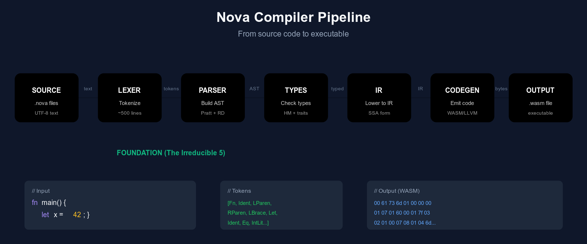

# Nova

**A programming language designed for the AI age.**

Verified. Efficient. Open.

---

## Mission

We're building a new programming language from scratch—not because the world needs another language, but because the world needs a *different kind* of language.

Current languages were designed for humans to write and machines to execute. Nova is designed for **AI to write and machines to verify**. The result: code that is mathematically proven correct, dramatically more efficient, and impossible to exploit.

### Why Nova?

| Today's Reality | Nova's Vision |
|-----------------|---------------|
| Runtime errors crash production | Errors are impossible by construction |
| Security vulnerabilities everywhere | Capabilities prevent unauthorized access |
| 10x abstraction overhead | Direct hardware mapping |
| AI generates buggy code | AI generates verified code |
| Humans debug machine output | Machines prove human intent |

## Core Principles

1. **Correctness is not optional.** Every program either proves itself correct or doesn't compile.

2. **Capabilities, not permissions.** Code can only access what it's explicitly given. No ambient authority.

3. **AI-native.** Optimized for LLMs to generate: minimal syntax, zero ambiguity, maximum verifiability.

4. **Self-hosting is day one.** The compiler is written in Nova. We eat our own dogfood immediately.

5. **Radical openness.** Everything is open source. The spec, the compiler, the tools, the governance.

## Quick Example

```nova
// A function that sorts a list
// The compiler PROVES these properties:
//   - Output has same length as input
//   - Output is sorted
//   - Output is a permutation of input

fn sort(input: Vec<i32>) -> Vec<i32>
where
    ensures output.len() == input.len(),
    ensures output.is_sorted(),
    ensures output.is_permutation_of(input),
{
    // Implementation here
    // If it doesn't satisfy the properties, it won't compile
}
```

## Compiler Pipeline



## Project Status

🚧 **Stage 0: Bootstrap** — We're building the minimal Rust compiler that will compile the first Nova compiler.

See [ROADMAP.md](ROADMAP.md) for the full plan.

## Documentation

| Document | Description |
|----------|-------------|
| [ROADMAP.md](ROADMAP.md) | Development stages and milestones |
| [COMPONENTS.md](COMPONENTS.md) | 43-component architecture with QA criteria |
| [FOUNDATION.md](FOUNDATION.md) | The 5 irreducible foundation components |
| [DECISIONS.md](DECISIONS.md) | Architectural decisions with rationale |
| [CONTRIBUTING.md](CONTRIBUTING.md) | How to contribute |
| [GOVERNANCE.md](GOVERNANCE.md) | BDFL model and approval process |

## Get Involved

We're looking for contributors! Nova is designed to be built by a community.

### Easy First Contributions
- [ ] [#1 Lexer: Basic tokenization](../../issues/1)
- [ ] [#2 Parser: Expression parsing](../../issues/2)
- [ ] [#3 Docs: Language syntax spec](../../issues/3)

### More Involved
- [ ] [#4 Type system: Inference engine](../../issues/4)
- [ ] [#5 Codegen: WASM output](../../issues/5)

See [CONTRIBUTING.md](CONTRIBUTING.md) for how to get started.

## Architecture

```
nova/
├── bootstrap/          # Rust bootstrap compiler (temporary)
├── stage1/             # Nova compiler written in Nova
├── std/                # Standard library
├── spec/               # Language specification
├── tools/              # LSP, formatter, etc.
└── examples/           # Example programs
```

## Building

### Prerequisites
- Rust 1.75+ (for bootstrap only)
- LLVM 17+ (for native codegen)

### Build the bootstrap compiler
```bash
cd bootstrap
cargo build --release
```

### Compile a Nova program
```bash
./target/release/nova compile examples/hello.nova -o hello.wasm
```

### Run tests
```bash
cargo test
```

## Governance

Nova uses a **BDFL (Benevolent Dictator for Life)** governance model.

- All PRs require approval from @pdaxt before merge
- See [GOVERNANCE.md](GOVERNANCE.md) for details
- Contributors can open issues, PRs, and participate in discussions

## Community

- **Discord**: [Join our Discord](https://discord.gg/nova-lang) (coming soon)
- **Discussions**: [GitHub Discussions](../../discussions)
- **Twitter/X**: [@nova_lang](https://twitter.com/nova_lang) (coming soon)

## License

Nova is dual-licensed under MIT and Apache 2.0. See [LICENSE-MIT](LICENSE-MIT) and [LICENSE-APACHE](LICENSE-APACHE).

## Acknowledgments

Nova stands on the shoulders of giants:
- [Rust](https://rust-lang.org) — Memory safety without GC
- [Lean](https://lean-lang.org) — Dependent types and proofs
- [Zig](https://ziglang.org) — Simplicity and control
- [LLVM](https://llvm.org) — Production-grade codegen

---

**Nova: Code that proves itself.**
