# Nova Architecture Diagrams

> Mermaid diagrams for Nova's compilation pipeline and architecture.
> These render automatically on GitHub and in most markdown viewers.

## Compilation Pipeline

The complete journey from Nova source code to verified WebAssembly:


## Foundation Components

The 5 irreducible components that form Nova's foundation:

```mermaid
flowchart TB
    subgraph Foundation["Foundation Layer"]
        direction LR
        S["Span\n📍 Location"]
        T["Token\n🔤 Lexeme"]
        SR["Source\n📄 Content"]
        E["Error\n⚠️ Diagnostic"]
        L["Lexer\n⚙️ Tokenizer"]
    end

    SR --> L
    L --> T
    T --> S
    L --> E
    E --> S

    style S fill:#06b6d4,stroke:#0891b2,color:#fff
    style T fill:#8b5cf6,stroke:#7c3aed,color:#fff
    style SR fill:#3b82f6,stroke:#2563eb,color:#fff
    style E fill:#f59e0b,stroke:#d97706,color:#fff
    style L fill:#14b8a6,stroke:#0d9488,color:#fff
```



## Type System Flow

Bidirectional type checking with refinement verification:


## Error Reporting Flow

How Nova generates beautiful, actionable error messages:

```mermaid
flowchart LR
    subgraph Detection
        ERR["Error\nDetected"]
    end

    subgraph Context
        SPAN["Span\nLookup"]
        SRC["Source\nRetrieval"]
        CTX["Context\nGathering"]
    end

    subgraph Rendering
        FMT["Format\n(ariadne)"]
        JSON["JSON\n(for AI)"]
    end

    subgraph Output
        TERM["Terminal\n🎨 Colored"]
        LSP["LSP\n💡 IDE"]
        AI["AI Agent\n🤖 Fixable"]
    end

    ERR --> SPAN --> SRC --> CTX
    CTX --> FMT --> TERM
    CTX --> JSON --> LSP
    CTX --> JSON --> AI

    style ERR fill:#ef4444,stroke:#dc2626,color:#fff
    style SPAN fill:#06b6d4,stroke:#0891b2,color:#fff
    style FMT fill:#a855f7,stroke:#9333ea,color:#fff
    style TERM fill:#22c55e,stroke:#16a34a,color:#fff
    style AI fill:#6366f1,stroke:#4f46e5,color:#fff
```



## WASM Codegen Pipeline

From Nova IR to WebAssembly binary:

```mermaid
flowchart TD
    subgraph "Nova IR"
        IR["Typed IR"]
    end

    subgraph "WASM Sections"
        direction LR
        TY["Type\nSection"]
        FN["Function\nSection"]
        EX["Export\nSection"]
        CD["Code\nSection"]
    end

    subgraph "Binary Encoding"
        ENC["wasm-encoder"]
    end

    subgraph "Output"
        WASM[".wasm Binary"]
        WAT[".wat Text\n(Debug)"]
    end

    subgraph "Execution"
        BROWSER["Browser\n🌐"]
        SERVER["Wasmtime\n🖥️"]
        EDGE["Edge\n☁️"]
    end

    IR --> TY
    IR --> FN
    IR --> EX
    IR --> CD
    TY --> ENC
    FN --> ENC
    EX --> ENC
    CD --> ENC
    ENC --> WASM
    ENC --> WAT
    WASM --> BROWSER
    WASM --> SERVER
    WASM --> EDGE

    style IR fill:#f97316,stroke:#ea580c,color:#fff
    style ENC fill:#22c55e,stroke:#16a34a,color:#fff
    style WASM fill:#6366f1,stroke:#4f46e5,color:#fff
    style BROWSER fill:#3b82f6,stroke:#2563eb,color:#fff
    style SERVER fill:#8b5cf6,stroke:#7c3aed,color:#fff
    style EDGE fill:#14b8a6,stroke:#0d9488,color:#fff
```



## Verification Levels

Nova's progressive verification from parsing to full proofs:


## Project Structure

Nova's codebase organization:

```mermaid
flowchart TB
    subgraph "nova/"
        direction TB
        BS["bootstrap/\n🦀 Rust impl"]
        DC["docs/\n📚 Website"]
        EX["examples/\n💡 Code samples"]
    end

    subgraph "bootstrap/src/"
        direction LR
        LX["lexer/"]
        PR["parser/"]
        TY["types/"]
        IR2["ir/"]
        CG["codegen/"]
        ER["errors/"]
    end

    subgraph "docs/"
        direction LR
        IDX["index.html"]
        AR["architecture/"]
        BR["brand/"]
    end

    BS --> LX
    BS --> PR
    BS --> TY
    BS --> IR2
    BS --> CG
    BS --> ER
    DC --> IDX
    DC --> AR
    DC --> BR

    style BS fill:#f97316,stroke:#ea580c,color:#fff
    style DC fill:#3b82f6,stroke:#2563eb,color:#fff
    style EX fill:#22c55e,stroke:#16a34a,color:#fff
```



---

## Using These Diagrams

These Mermaid diagrams render automatically on:
- GitHub (README, issues, PRs, wikis)
- GitLab
- Notion
- VS Code (with Mermaid extension)
- Most modern markdown viewers

To use in your own documentation:

```markdown
```mermaid
flowchart LR
    A --> B --> C
```​
```

For more Mermaid syntax, see [mermaid.js.org](https://mermaid.js.org/).
