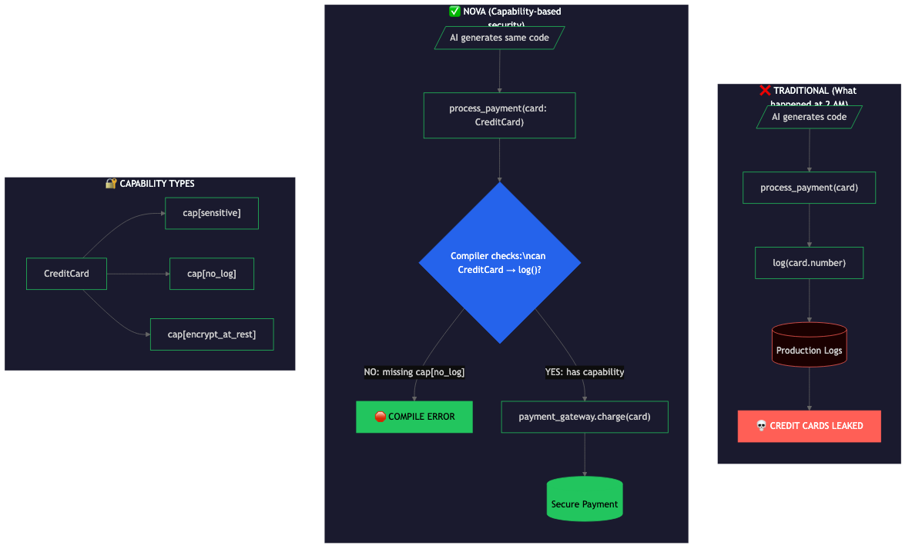

# Why Nova? The Credit Card Problem

> I found a bug on line 673 that would have leaked credit card numbers. So I'm building a programming language to fix it.

---

## The Problem That Started This

3 months ago I was reviewing AI-generated code at 2 AM.

847 lines. Payment processing. Passed every test.

Line 673? Would have logged customer credit cards in plain text.

I almost shipped it.

```python
# What the AI generated (simplified)
def process_payment(card):
    log(f"Processing payment for card: {card.number}")  # Line 673
    payment_gateway.charge(card)
```

**Why tests didn't catch it:**
- Functionally correct (payment works)
- No runtime errors
- Logs looked normal in dev (test card numbers)
- Only a human reading line 673 at 2 AM caught it

**The math that broke my brain:**
- AI generates code at 100x speed
- Humans review at 1x speed
- This doesn't scale

---

## Nova's Solution: Capability-Based Security



### The Core Idea

What if the compiler could verify that sensitive data never flows to unauthorized places?

Not through tests. Not through code review. Through mathematical proof at compile time.

### Three Mechanisms

| Mechanism | What it does | Credit card example |
|-----------|--------------|---------------------|
| **Capability types** | Data tagged with what it can/can't do | `cap[sensitive, no_log]` |
| **Static checking** | Compiler verifies at compile time | Rejects `log(card)` before runtime |
| **No ambient authority** | Functions only access what they're given | `log()` can't touch sensitive data |

---

## How It Works

### Traditional Approach (What Failed)

```
AI generates code
       ↓
process_payment(card)
       ↓
log(card.number)      ← Nothing stops this
       ↓
Production Logs
       ↓
💀 CREDIT CARDS LEAKED
```

### Nova Approach (Capability-Based)

```
AI generates same code
       ↓
process_payment(card: CreditCard)
       ↓
Compiler checks: can CreditCard → log()?
       ↓
NO: missing cap[no_log]
       ↓
🛑 COMPILE ERROR
```

---

## Code Example

```nova
// Credit card type has capability restrictions
type CreditCard = String with cap[sensitive, no_log, encrypt_at_rest]

fn process_payment(card: CreditCard) {
    // This FAILS at compile time:
    log(card)
    // ERROR: CreditCard has cap[no_log], cannot flow to log()

    // This WORKS - payment processor has the capability:
    payment_gateway.charge(card)
    // OK: gateway has cap[sensitive] authorization
}

// The log function signature:
fn log(msg: String with cap[!sensitive]) {
    // Can only accept non-sensitive data
}
```

---

## Capability Types

A `CreditCard` in Nova would have these capabilities:

| Capability | What it means |
|------------|---------------|
| `cap[sensitive]` | Contains PII/financial data |
| `cap[no_log]` | Cannot flow to logging functions |
| `cap[encrypt_at_rest]` | Must be encrypted when stored |
| `cap[mask_display]` | Must be masked when displayed (****1234) |

The compiler enforces these at compile time. Not runtime. Not tests. **Compile time.**

---

## The 2 AM Scenario with Nova

1. AI generates the same buggy code
2. Developer runs `nova build`
3. Compiler returns:
   ```
   ERROR[E0401]: capability violation
     --> src/payment.rs:673:5
      |
   673|     log(card.number)
      |     ^^^^^^^^^^^^^^^^
      |
      = note: `CreditCard` has cap[no_log]
      = note: `log()` requires cap[!sensitive]
      = help: use `log(card.masked())` instead
   ```
4. Bug caught before code review, before tests, before production

---

## Why This Matters for AI-Generated Code

| Without Nova | With Nova |
|--------------|-----------|
| Human must review every line | Compiler verifies safety properties |
| Bugs found in production | Bugs found at compile time |
| Review speed = 1x | Verification speed = 1000x |
| Security depends on human attention | Security is mathematically proven |

**The thesis:** As AI generates more code, we need verification that scales with generation. Human review doesn't scale. Formal verification does.

---

## Current Status

**What's built:**
- Lexer (tokenization) ✅
- Parser (AST generation) ✅
- Type system foundation ✅
- 91 tests passing ✅
- 40 adversarial security tests ✅

**What's next (Phase 2):**
- [ ] Capability types
- [ ] Static capability checking
- [ ] Formal verification integration
- [ ] SMT solver integration (Z3)

See [ROADMAP.md](../ROADMAP.md) for the full plan.

---

## Get Involved

The 3% who understand formal verification will shape the future of software.

**How to join:**

🟢 **Easy:** Fix a typo. Add a test. Ask a question.
🟡 **Medium:** Improve error messages. Write docs.
🔴 **Hard:** Build the type system with me.

Every contribution matters. Every question is valid.

- **Start here:** [CONTRIBUTING.md](../CONTRIBUTING.md)
- **Learn the foundation:** [FOUNDATION.md](../FOUNDATION.md)
- **Understand decisions:** [DECISIONS.md](../DECISIONS.md)

---

## The Honest Caveat

This is Phase 2 on the roadmap. The capability system isn't built yet.

We're building the foundation first: a correct, well-tested compiler infrastructure that can support formal verification.

If you want to help build the future of AI-safe programming, [start here](../CONTRIBUTING.md).

---

*"Code that proves itself correct, or doesn't compile. Period."*
